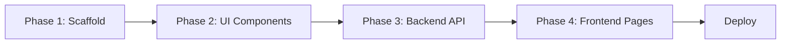

# TagX — Fullstack E-Commerce Website for Smart Bluetooth Tracker

> **Pitch**: TagX is a premium smart Bluetooth tracker for bags, phones, kids, pets, and more. This fullstack website is where we **sell it** — not a brochure, but a real commerce platform with AI-powered features that wows the panel.

## Current State

| Area | Status |
|---|---|
| **Frontend** | Bare Vite + React 19 scaffold. Only [App.tsx](file:///Users/anoop/FY%20BTECH/Sem-4/TagX/frontend/src/App.tsx) and [main.tsx](file:///Users/anoop/FY%20BTECH/Sem-4/TagX/frontend/src/main.tsx) exist. No routing, no styling, no components. |
| **Backend** | Empty [package.json](file:///Users/anoop/FY%20BTECH/Sem-4/TagX/backend/package.json) — no deps, no server, no structure. |
| **Design** | Nothing yet. Will follow [frontend-design SKILL](file:///Users/anoop/FY%20BTECH/Sem-4/TagX/.agents/skills/frontend-design/SKILL.md) — bold, distinctive, production-grade. |
| **Infra** | No `.env`, no root-level `.gitignore`, no linting for backend. |

---

## Design Direction (Frontend-Design Skill)

> **Aesthetic**: **"Stealth-Luxury Tech"** — Think matte-black product shots floating in negative space, surgical precision typography, and mercury-like liquid animations. The vibe is Apple-meets-Dieter-Rams: obsessively minimal but magnetically premium.

| Token | Choice |
|---|---|
| **Theme** | Dark-mode dominant. Deep charcoal `#0A0A0B` base, with electric cyan `#00E5FF` and warm amber `#FFB347` accents. |
| **Display Font** | **Clash Display** (Indian Type Foundry, free) — geometric, bold, editorial feel. |
| **Body Font** | **Satoshi** — clean, modern, excellent readability. |
| **Motion** | Framer Motion — page transitions, scroll-reveal, staggered card entrances, magnetic cursor effects on CTAs. |
| **Layout** | Asymmetric hero grids, full-bleed product sections, overlapping elements, diagonal flow for product showcase. |
| **Signature detail** | A subtle animated radar-ping effect on CTAs and product cards — reinforcing "we help you find things." |

> [!IMPORTANT]
> This design direction is intentionally opinionated per the frontend-design skill. If you prefer a different tone (e.g., playful/colorful, brutalist, soft/pastel), let me know and I'll pivot.

---

## Tech Stack Summary

| Layer | Technology |
|---|---|
| Frontend | React 19 + Vite 8 + TypeScript |
| Styling | Tailwind CSS v4 + shadcn/ui |
| Animations | Framer Motion |
| Routing | React Router v7 |
| State | Zustand (lightweight, perfect for cart/auth state) |
| Forms | React Hook Form + Zod validation |
| HTTP | Axios |
| Backend | Node.js + Express + TypeScript |
| Database | MongoDB + Mongoose |
| Auth | JWT (access + refresh tokens) + bcrypt |
| AI | Groq SDK (LLaMA-based, free for testing) via AI SDK |
| File Upload | Multer + Cloudinary |
| Email | Nodemailer (for forgot-password OTP) |
| Deployment | Frontend → Vercel, Backend → Render |

---

## Open Questions

> [!IMPORTANT]
> Please answer these so I can finalize before execution:

1. **MongoDB**: Do you already have a MongoDB Atlas cluster, or should I include setup instructions for one?
2. **Cloudinary**: Do you have a Cloudinary account for product image hosting, or should we use local/static images for the MVP?
3. **Groq API Key**: Do you have a Groq API key already, or do you need setup guidance?
4. **Payment Gateway**: Should we integrate a mock payment flow (Razorpay test mode / Stripe test mode) or skip payments for the MVP pitch?
5. **Admin Panel**: Do you need an admin dashboard to manage products/orders, or is a seeded database + API enough for the demo?
6. **Tailwind version**: You mentioned Tailwind + shadcn. Should I use **Tailwind v4** (latest, CSS-first config) or **Tailwind v3** (more stable shadcn support)? I recommend **v4** with the latest shadcn CLI.

---

## Phase 1 — Project Scaffolding & Infrastructure

> Goal: Both frontend and backend are properly structured, all deps installed, tooling configured, ready to build.

### Frontend Scaffolding

#### [MODIFY] [package.json](file:///Users/anoop/FY%20BTECH/Sem-4/TagX/frontend/package.json)

Add all required frontend dependencies:

**Dependencies to add:**
```
react-router-dom          # Client-side routing
framer-motion             # Animations & page transitions
zustand                   # Lightweight state management (cart, auth, UI)
react-hook-form           # Form handling
@hookform/resolvers       # Zod resolver for react-hook-form
zod                       # Schema validation
axios                     # HTTP client
lucide-react              # Icon library (used by shadcn)
clsx                      # Conditional class utility
tailwind-merge            # Merge tailwind classes without conflicts
class-variance-authority  # Component variant management (shadcn pattern)
sonner                    # Toast notifications
@radix-ui/react-slot      # Slot primitive (shadcn foundation)
```

**Dev dependencies to add:**
```
tailwindcss@4             # Tailwind CSS v4
@tailwindcss/vite         # Vite plugin for Tailwind v4
autoprefixer              # CSS autoprefixer
```

#### Frontend Folder Structure

```
frontend/src/
├── assets/                  # Static images, fonts, SVGs
│   ├── fonts/
│   ├── images/
│   └── icons/
├── components/
│   ├── ui/                  # shadcn/ui primitives (Button, Input, Card, etc.)
│   ├── common/              # Shared components (Logo, Loader, ErrorBoundary)
│   └── layout/              # Layout shells (Navbar, Footer, Sidebar, PageWrapper)
├── features/                # Feature-based modules
│   ├── auth/                # Login, Signup, ForgotPassword components
│   ├── home/                # Hero, Features, Testimonials, CTA sections
│   ├── products/            # ProductCard, ProductGrid, ProductDetail
│   ├── cart/                # CartDrawer, CartItem, CartSummary
│   ├── ai/                  # AI Chat widget, AI product recommendations
│   └── tracking/            # Live tracking demo/map component
├── hooks/                   # Custom React hooks (useAuth, useCart, useAI)
├── lib/                     # Utilities
│   ├── utils.ts             # cn() helper, formatters
│   ├── api.ts               # Axios instance with interceptors
│   └── constants.ts         # App-wide constants
├── pages/                   # Route-level page components
│   ├── HomePage.tsx
│   ├── ProductsPage.tsx
│   ├── ProductDetailPage.tsx
│   ├── CartPage.tsx
│   ├── CheckoutPage.tsx
│   ├── LoginPage.tsx
│   ├── SignupPage.tsx
│   ├── ForgotPasswordPage.tsx
│   ├── DashboardPage.tsx    # User dashboard (orders, tracked items)
│   ├── AboutPage.tsx
│   ├── ContactPage.tsx
│   └── NotFoundPage.tsx
├── stores/                  # Zustand stores
│   ├── authStore.ts
│   ├── cartStore.ts
│   └── uiStore.ts
├── styles/
│   └── globals.css          # Tailwind directives, CSS variables, font imports
├── types/                   # TypeScript type definitions
│   ├── auth.types.ts
│   ├── product.types.ts
│   ├── cart.types.ts
│   └── api.types.ts
├── App.tsx                  # Root component with router
├── main.tsx                 # Entry point
└── router.tsx               # Route definitions
```

#### [NEW] Configuration Files

| File | Purpose |
|---|---|
| `frontend/.env.example` | Template: `VITE_API_URL`, `VITE_GROQ_API_KEY` |
| `frontend/.env.local` | Actual env values (gitignored) |
| `frontend/src/styles/globals.css` | Tailwind v4 imports, CSS custom properties, font-face declarations |

---

### Backend Scaffolding

#### [MODIFY] [package.json](file:///Users/anoop/FY%20BTECH/Sem-4/TagX/backend/package.json)

Convert to ES modules with TypeScript. Add:

**Dependencies:**
```
express                   # Web framework
mongoose                  # MongoDB ODM
jsonwebtoken              # JWT generation & verification
bcryptjs                  # Password hashing
cors                      # CORS middleware
dotenv                    # Environment variables
helmet                    # Security headers
morgan                    # HTTP request logging
express-rate-limit        # Rate limiting
express-validator         # Request validation
multer                    # File uploads
cloudinary                # Image hosting
nodemailer                # Email service (forgot password)
groq-sdk                  # Groq AI API
cookie-parser             # Parse cookies (refresh tokens)
```

**Dev dependencies:**
```
typescript                # TypeScript compiler
tsx                       # TypeScript execution (dev)
@types/express
@types/cors
@types/jsonwebtoken
@types/bcryptjs
@types/morgan
@types/multer
@types/cookie-parser
@types/nodemailer
@types/node
nodemon                   # Auto-restart on changes
eslint                    # Linting
@typescript-eslint/parser
@typescript-eslint/eslint-plugin
```

#### Backend Folder Structure

```
backend/
├── src/
│   ├── config/
│   │   ├── db.ts              # MongoDB connection
│   │   ├── env.ts             # Validated env variables
│   │   ├── cloudinary.ts      # Cloudinary config
│   │   └── mail.ts            # Nodemailer transporter
│   ├── models/
│   │   ├── User.ts
│   │   ├── Product.ts
│   │   ├── Order.ts
│   │   ├── Cart.ts
│   │   ├── Review.ts
│   │   └── OTP.ts             # For forgot-password flow
│   ├── routes/
│   │   ├── auth.routes.ts
│   │   ├── product.routes.ts
│   │   ├── cart.routes.ts
│   │   ├── order.routes.ts
│   │   ├── review.routes.ts
│   │   ├── ai.routes.ts
│   │   └── index.ts           # Route aggregator
│   ├── controllers/
│   │   ├── auth.controller.ts
│   │   ├── product.controller.ts
│   │   ├── cart.controller.ts
│   │   ├── order.controller.ts
│   │   ├── review.controller.ts
│   │   └── ai.controller.ts
│   ├── services/
│   │   ├── auth.service.ts
│   │   ├── product.service.ts
│   │   ├── cart.service.ts
│   │   ├── order.service.ts
│   │   ├── email.service.ts
│   │   └── ai.service.ts
│   ├── middlewares/
│   │   ├── auth.middleware.ts     # JWT verification
│   │   ├── admin.middleware.ts    # Admin role check
│   │   ├── validate.middleware.ts # Request validation
│   │   ├── error.middleware.ts    # Global error handler
│   │   └── upload.middleware.ts   # Multer config
│   ├── utils/
│   │   ├── ApiError.ts           # Custom error class
│   │   ├── ApiResponse.ts        # Standardized responses
│   │   ├── asyncHandler.ts       # Async route wrapper
│   │   └── tokens.ts             # JWT token utilities
│   ├── validators/
│   │   ├── auth.validator.ts
│   │   ├── product.validator.ts
│   │   └── order.validator.ts
│   ├── types/
│   │   └── index.ts              # Express req extensions, custom types
│   ├── seeds/
│   │   └── seed.ts               # Seed products, demo user
│   └── server.ts                 # Express app bootstrap
├── .env.example
├── .env
├── tsconfig.json
├── nodemon.json
├── .eslintrc.json
└── package.json
```

#### [NEW] Root-Level Files

| File | Location | Purpose |
|---|---|---|
| `.gitignore` | `/TagX/.gitignore` | Root gitignore covering both frontend & backend |
| `.env.example` | `/TagX/backend/.env.example` | Template for backend env vars |
| `README.md` | `/TagX/README.md` | Project overview with setup instructions |

#### Root `.gitignore` contents:
```
node_modules/
dist/
.env
.env.local
*.log
.DS_Store
.vscode/
.idea/
```

---

## Phase 2 — UI Component Library (Tailwind + shadcn/ui)

> Goal: A complete design system with all reusable components installed and themed to match the "Stealth-Luxury Tech" aesthetic.

### Step 2.1 — Tailwind v4 Setup

#### [NEW] `frontend/src/styles/globals.css`
- Import Tailwind v4 via `@import "tailwindcss"`
- Define CSS custom properties for the TagX theme:
  ```css
  @theme {
    --color-tagx-bg: #0A0A0B;
    --color-tagx-surface: #141416;
    --color-tagx-border: #2A2A2E;
    --color-tagx-text: #EAEAEA;
    --color-tagx-muted: #8A8A8E;
    --color-tagx-accent: #00E5FF;
    --color-tagx-warm: #FFB347;
    --color-tagx-danger: #FF4757;
    --color-tagx-success: #2ED573;
    --font-display: 'Clash Display', sans-serif;
    --font-body: 'Satoshi', sans-serif;
    /* ... radii, shadows, etc. */
  }
  ```
- Font-face declarations for Clash Display + Satoshi (loaded from assets or CDN)

#### [MODIFY] `frontend/vite.config.ts`
- Add `@tailwindcss/vite` plugin

### Step 2.2 — shadcn/ui Initialization

Run `npx shadcn@latest init` to bootstrap shadcn in the project. Then install components:

**Core UI primitives to install:**
| Component | Use Case |
|---|---|
| `button` | CTAs, form submits, nav actions |
| `input` | Text fields, search bars |
| `label` | Form labels |
| `card` | Product cards, feature cards, testimonials |
| `dialog` | Modals (quick view, confirm delete) |
| `dropdown-menu` | User menu, sort options |
| `sheet` | Cart drawer (slide-in from right) |
| `avatar` | User profile pictures |
| `badge` | Product tags ("New", "Best Seller") |
| `separator` | Visual dividers |
| `skeleton` | Loading states |
| `toast` / `sonner` | Notifications |
| `tabs` | Product detail tabs (Specs, Reviews, FAQ) |
| `accordion` | FAQ sections |
| `select` | Dropdowns (color picker, quantity) |
| `checkbox` | Filters, terms agreement |
| `form` | shadcn form wrapper with react-hook-form |
| `scroll-area` | Custom scrollable regions |
| `navigation-menu` | Main navbar |
| `carousel` | Product image gallery |
| `tooltip` | Hover hints |
| `progress` | Order tracking steps |
| `slider` | Price range filter |

### Step 2.3 — Custom Common Components

#### `components/common/`

| Component | Description |
|---|---|
| `Logo.tsx` | TagX logo with radar-ping animation |
| `Loader.tsx` | Full-screen and inline loading spinners |
| `ErrorBoundary.tsx` | Graceful error handling wrapper |
| `SectionHeading.tsx` | Reusable section title with accent underline |
| `AnimatedCounter.tsx` | Number counter animation (for stats) |
| `RadarPing.tsx` | The signature animated radar effect |
| `GradientBlob.tsx` | Decorative background mesh gradient blobs |
| `ParallaxImage.tsx` | Scroll-aware parallax product image |

#### `components/layout/`

| Component | Description |
|---|---|
| `Navbar.tsx` | Sticky navbar with logo, links, cart badge, user menu. Glassmorphic blur on scroll. |
| `Footer.tsx` | Multi-column footer with links, newsletter signup, social icons. |
| `PageWrapper.tsx` | Wraps each page with enter/exit animations (Framer Motion `AnimatePresence`). |
| `Container.tsx` | Max-width content wrapper. |
| `MobileNav.tsx` | Sheet-based mobile navigation. |

---

## Phase 3 — Backend Architecture

> Goal: Fully functional API with authentication, product CRUD, cart, orders, AI integration, and proper middleware pipeline.

### Step 3.1 — Database Schema (MongoDB/Mongoose)

#### User Model
```typescript
{
  name: string;
  email: string;           // unique, indexed
  password: string;        // bcrypt hashed
  role: 'user' | 'admin';  // default: 'user'
  avatar?: string;         // Cloudinary URL
  phone?: string;
  address: {
    street: string;
    city: string;
    state: string;
    zip: string;
    country: string;
  };
  refreshToken?: string;
  isVerified: boolean;     // email verification
  createdAt: Date;
  updatedAt: Date;
}
```

#### Product Model
```typescript
{
  name: string;             // "TagX Pro", "TagX Mini", "TagX Pet"
  slug: string;             // URL-friendly name
  description: string;
  shortDescription: string;
  price: number;
  compareAtPrice?: number;  // Strikethrough price
  images: string[];         // Cloudinary URLs
  category: 'personal' | 'pet' | 'vehicle' | 'luggage' | 'kids';
  colors: { name: string; hex: string; }[];
  features: string[];
  specs: {
    battery: string;
    range: string;
    waterproof: string;
    weight: string;
    dimensions: string;
    connectivity: string;
  };
  stock: number;
  rating: number;           // Computed average
  reviewCount: number;
  isFeatured: boolean;
  isActive: boolean;
  createdAt: Date;
  updatedAt: Date;
}
```

#### Order Model
```typescript
{
  user: ObjectId;           // ref: User
  items: [{
    product: ObjectId;      // ref: Product
    quantity: number;
    price: number;
    color: string;
  }];
  shippingAddress: { ... };
  totalAmount: number;
  status: 'pending' | 'confirmed' | 'shipped' | 'delivered' | 'cancelled';
  paymentStatus: 'pending' | 'paid' | 'failed';
  paymentMethod: string;
  trackingNumber?: string;
  createdAt: Date;
  updatedAt: Date;
}
```

#### Cart Model
```typescript
{
  user: ObjectId;           // ref: User
  items: [{
    product: ObjectId;      // ref: Product
    quantity: number;
    color: string;
  }];
  updatedAt: Date;
}
```

#### Review Model
```typescript
{
  user: ObjectId;           // ref: User
  product: ObjectId;        // ref: Product
  rating: number;           // 1-5
  title: string;
  comment: string;
  isVerifiedPurchase: boolean;
  createdAt: Date;
}
```

#### OTP Model
```typescript
{
  email: string;
  otp: string;              // 6-digit code, hashed
  expiresAt: Date;          // 10-minute expiry
  createdAt: Date;          // TTL index
}
```

### Step 3.2 — Middleware Pipeline

Request flow through Express:

```
Request
  → helmet()                    // Security headers
  → cors()                     // CORS policy
  → express.json()             // Body parsing
  → cookieParser()             // Cookie parsing
  → morgan('dev')              // Request logging
  → rateLimiter()              // Rate limiting (100 req/15min)
  → routes                     // Route handlers
      → validate.middleware    // Request validation (express-validator)
      → auth.middleware        // JWT verification (for protected routes)
      → admin.middleware       // Admin role check (for admin routes)
      → controller             // Business logic
  → error.middleware           // Global error handler (catches ApiError)
```

### Step 3.3 — API Routes

#### Auth Routes (`/api/v1/auth`)
| Method | Endpoint | Auth | Description |
|---|---|---|---|
| POST | `/register` | ✗ | Create account |
| POST | `/login` | ✗ | Login, returns access + refresh token |
| POST | `/logout` | ✓ | Clear refresh token |
| POST | `/refresh-token` | ✗ | Get new access token |
| POST | `/forgot-password` | ✗ | Send OTP to email |
| POST | `/reset-password` | ✗ | Verify OTP & reset password |
| GET | `/me` | ✓ | Get current user profile |
| PUT | `/me` | ✓ | Update profile |

#### Product Routes (`/api/v1/products`)
| Method | Endpoint | Auth | Description |
|---|---|---|---|
| GET | `/` | ✗ | List all products (pagination, filters, search) |
| GET | `/:slug` | ✗ | Get single product by slug |
| GET | `/featured` | ✗ | Get featured products |
| GET | `/categories` | ✗ | Get available categories |
| POST | `/` | Admin | Create product |
| PUT | `/:id` | Admin | Update product |
| DELETE | `/:id` | Admin | Delete product |

#### Cart Routes (`/api/v1/cart`)
| Method | Endpoint | Auth | Description |
|---|---|---|---|
| GET | `/` | ✓ | Get user cart |
| POST | `/add` | ✓ | Add item to cart |
| PUT | `/update` | ✓ | Update item quantity |
| DELETE | `/remove/:productId` | ✓ | Remove item from cart |
| DELETE | `/clear` | ✓ | Clear entire cart |

#### Order Routes (`/api/v1/orders`)
| Method | Endpoint | Auth | Description |
|---|---|---|---|
| POST | `/` | ✓ | Place order (from cart) |
| GET | `/` | ✓ | Get user's orders |
| GET | `/:id` | ✓ | Get single order |
| PUT | `/:id/status` | Admin | Update order status |

#### Review Routes (`/api/v1/reviews`)
| Method | Endpoint | Auth | Description |
|---|---|---|---|
| GET | `/product/:productId` | ✗ | Get reviews for a product |
| POST | `/product/:productId` | ✓ | Add review |
| DELETE | `/:id` | ✓ | Delete own review |

#### AI Routes (`/api/v1/ai`)
| Method | Endpoint | Auth | Description |
|---|---|---|---|
| POST | `/chat` | ✓ | Chat with TagX AI assistant |
| POST | `/recommend` | ✗ | Get product recommendations based on use-case |

### Step 3.4 — AI Integration (Groq)

The AI features serve as a **differentiator** for the pitch:

1. **TagX AI Assistant** — A chatbot widget that answers questions about TagX products, helps users pick the right tracker, and provides setup/troubleshooting guidance. Uses Groq's LLaMA model with a system prompt trained on TagX product data.

2. **Smart Recommendations** — User describes their use case (e.g., "I want to track my dog during hikes") and the AI recommends the best TagX product with reasoning.

**Implementation:**
- Backend: `ai.service.ts` wraps the Groq SDK, maintains conversation context, and injects TagX product catalog as system context.
- Frontend: Floating chat widget (bottom-right corner) with a sleek dark UI, typing indicators, and message bubbles.

### Step 3.5 — Seed Script

Create `seeds/seed.ts` to populate the database with:
- 5–6 TagX product variants (Pro, Mini, Pet, Vehicle, Kids, Luggage)
- 1 admin user and 1 demo user
- Sample reviews
- Product images (either Cloudinary URLs or placeholder paths)

---

## Phase 4 — Frontend Pages & Features

> Goal: All user-facing pages built, connected to API, polished with animations.

### Step 4.1 — Routing Setup

#### [MODIFY] `App.tsx`
Setup React Router with layout wrapping:

```
/                  → HomePage
/products          → ProductsPage
/products/:slug    → ProductDetailPage
/cart              → CartPage
/checkout          → CheckoutPage
/login             → LoginPage
/signup            → SignupPage
/forgot-password   → ForgotPasswordPage
/dashboard         → DashboardPage (protected)
/about             → AboutPage
/contact           → ContactPage
*                  → NotFoundPage
```

### Step 4.2 — Auth Pages

#### `LoginPage.tsx`
- Split-screen layout: left side = immersive product visual, right side = form
- Email + password inputs with Zod validation
- "Remember me" toggle
- Link to signup and forgot-password
- JWT token storage in httpOnly cookie (via API) + Zustand auth state
- Animated page transition on success

#### `SignupPage.tsx`
- Same split-screen aesthetic
- Name, email, password, confirm password
- Password strength indicator with animated bar
- Terms & conditions checkbox
- Auto-login after successful registration

#### `ForgotPasswordPage.tsx`
- Step 1: Enter email → sends OTP
- Step 2: Enter 6-digit OTP → verify
- Step 3: New password + confirm → reset
- Animated step transitions with progress indicator

### Step 4.3 — Home Page (The Hero Pitch)

This is the **showstopper** — the page that sells TagX to the panel.

| Section | Description |
|---|---|
| **Hero** | Full-viewport dark section. Floating 3D-style TagX product image with magnetic cursor parallax. Bold "Never Lose What Matters" headline in Clash Display. Animated radar-ping behind product. Dual CTAs: "Shop Now" (accent) and "See How It Works" (ghost). |
| **Stats Bar** | Animated counters: "50K+ Users", "99.9% Recovery Rate", "1 Year Battery", "300ft Range". Slide in on scroll. |
| **Product Showcase** | Horizontal scroll carousel of TagX variants. Each card has hover-reveal specs, price, and "Add to Cart" quick action. |
| **How It Works** | 3-step process with animated illustrations: 1) Attach TagX → 2) Open App → 3) Track Anywhere. Scroll-triggered animations. |
| **Features Grid** | Bento-grid layout showcasing: Precision Finding, Crowd GPS Network, Water Resistant, Long Battery, Universal Compatibility, Privacy First. Each tile with icon + micro-animation. |
| **AI Demo** | Interactive section: "Tell us what you want to track" — user types a use-case, AI instantly recommends a product. Live demo of the recommendation engine. |
| **Testimonials** | Carousel of customer reviews with star ratings, avatar, name. Auto-play with pause on hover. |
| **Newsletter CTA** | Full-width gradient section with email signup. "Get 10% off your first TagX." |

### Step 4.4 — Products Page

- Grid/list view toggle
- Sidebar filters: category, price range (slider), rating, sort by
- Product cards with:
  - Image with hover-zoom
  - Name, price, rating stars
  - Quick "Add to Cart" button
  - Color swatches
  - "Featured" / "New" badges
- Pagination
- Search bar with instant results

### Step 4.5 — Product Detail Page

- Large product image gallery (carousel with thumbnail strip)
- Color selector with live image swap
- Quantity selector
- "Add to Cart" + "Buy Now" CTAs
- Tabbed content: Description | Specifications | Reviews
- Related products section
- Scroll-triggered animations for each section

### Step 4.6 — Cart & Checkout

- **Cart**: Sheet drawer (slide from right) + full cart page
  - Item list with image, name, color, quantity +/-, remove, subtotal
  - Cart summary: subtotal, shipping, tax, total
  - "Proceed to Checkout" CTA
- **Checkout**: Multi-step form
  - Step 1: Shipping address
  - Step 2: Order review
  - Step 3: Confirmation (mock — or real if payment gateway is added)

### Step 4.7 — User Dashboard

- Order history with status badges
- Profile editing
- "My Tracked Items" section (simulated — shows purchased products with mock tracking status)

### Step 4.8 — Other Pages

- **About**: Company story, mission, team (can use placeholder content)
- **Contact**: Contact form + embedded map (optional)
- **404**: Creative not-found page with "lost tracker" theme and radar animation

### Step 4.9 — AI Chat Widget

- Floating button (bottom-right) with pulse animation
- Expands into a chat panel
- Message bubbles with typing indicator
- Predefined quick-action chips: "Help me choose", "Setup guide", "Track my order"
- Dark-themed, matches the site aesthetic

---

## Deployment Strategy

| Service | Target | Config |
|---|---|---|
| **Vercel** | Frontend | Auto-deploy from GitHub. Env vars: `VITE_API_URL` |
| **Render** | Backend | Node.js service. Env vars: MongoDB URI, JWT secrets, Groq key, Cloudinary creds, email creds |
| **MongoDB Atlas** | Database | Free tier (M0), cloud-hosted |
| **Cloudinary** | Images | Free tier, product image CDN |

---

## Verification Plan

### Automated/Manual Testing Per Phase

| Phase | Verification |
|---|---|
| **Phase 1** | `npm run dev` starts both frontend and backend without errors. ESLint passes. TypeScript compiles. |
| **Phase 2** | All shadcn components render correctly. Tailwind classes apply. Theme tokens work. |
| **Phase 3** | All API endpoints tested via REST client (Thunder Client / Postman). Auth flow works end-to-end. Seed script populates DB. |
| **Phase 4** | Full user journey: Signup → Browse → Add to Cart → Checkout → Dashboard. Auth guards work. AI chat responds. Responsive on mobile. |

### Build Verification
```bash
# Frontend
cd frontend && npm run build   # Should produce dist/ without errors

# Backend
cd backend && npx tsc --noEmit  # Type check without errors
```

---

## Execution Order (Summary)



Each phase is a checkpoint — we verify before moving to the next. I'll create a `task.md` to track granular progress once you approve.

---

> [!TIP]
> This is designed to **win the pitch**. The AI features (chat + recommendations) are the differentiators. The dark luxury aesthetic makes it feel premium. The complete e-commerce flow shows it's a real MVP, not a mockup.
